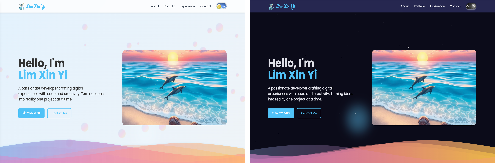

# Lim Xin Yi's Portfolio Website

A responsive personal portfolio website with light/dark mode toggle, showcasing projects, professional experience, and contact information. Built with HTML, CSS, JavaScript, and Tailwind CSS.

## Live Demo
This is my website!
Just visit the live site at: [https://haha-298.github.io/](https://haha-298.github.io/)

## Features

✨ **Dual Theme Design**
- Light Mode: Ocean-inspired theme with dolphins and waves
- Dark Mode: Space-themed with stars and particles

🎨 **Interactive Elements**
- 3D cursor blob effect
- Animated background elements (waves/particles)
- Smooth theme transition

📱 **Fully Responsive**
- Mobile-friendly navigation
- Adaptive layouts for all screen sizes

📂 **Project Showcase**
- Filterable portfolio grid
- Detailed project cards with technology tags

💼 **Professional Experience**
- Timeline-style work history
- Expandable job details

